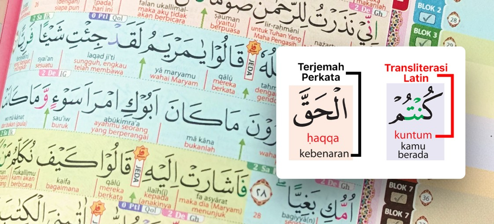
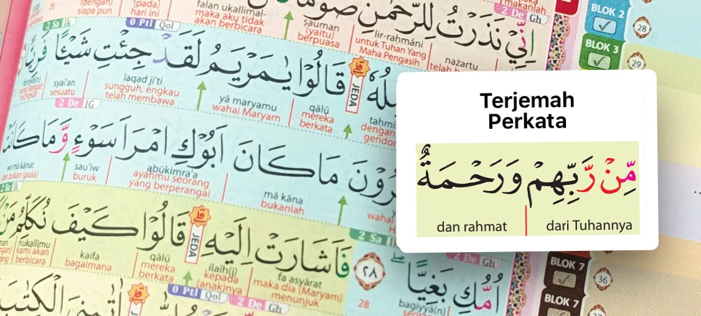

Task: Tambah Modal "Pilihan Quran" di Product Detail
Konteks
File: product-detail.html + style.css
Referensi visual: screenshot Image 1 (modal pilihan Latin vs Tanpa Latin)

1. Trigger Modal
Ubah behavior tombol #add-to-cart-btn (desktop) dan #add-to-cart-btn-mobile (mobile):
Kedua tombol ini jangan langsung ke cart. Ubah jadi membuka modal pilihan quran terlebih dahulu. Ganti handler-nya di script.js atau inline — cari bagian yang nge-handle add-to-cart-btn, kalau belum ada tambahkan:
jsdocument.getElementById('add-to-cart-btn')?.addEventListener('click', openQuranPickerModal);
document.getElementById('add-to-cart-btn-mobile')?.addEventListener('click', openQuranPickerModal);

2. HTML Modal
Sisipkan markup berikut sebelum closing </body>, di bawah #lightbox div:
html<!-- Modal Pilihan Quran -->

  
  <!-- Backdrop -->
  

  <!-- Sheet / Card -->
  

    
    <!-- Header -->
    

      <h2 class="text-lg font-display font-black text-slate-900 dark:text-white">Pilihan Quran</h2>
      <button onclick="closeQuranPickerModal()" 
              class="w-9 h-9 rounded-full bg-slate-100 dark:bg-slate-800 flex items-center justify-center text-slate-500 hover:text-slate-900 dark:hover:text-white transition-colors border-0">
        close
      </button>
    

    <!-- Options -->
    

      
      <!-- Opsi Latin -->
      <label id="quran-opt-latin" 
             class="quran-picker-card modal-cover-card selected cursor-pointer rounded-[1.25rem] overflow-hidden border-2 border-brand-blue relative"
             onclick="selectQuranType('latin')">
        <input type="radio" name="quran-type" value="latin" class="sr-only" checked>
        

          <!-- Ganti src dengan gambar preview Latin milik produk -->
          
          

            Latin
          

        

        <!-- Checkmark -->
        

          check
        

      </label>

      <!-- Opsi Tanpa Latin -->
      <label id="quran-opt-tanpa-latin" 
             class="quran-picker-card modal-cover-card cursor-pointer rounded-[1.25rem] overflow-hidden border-2 border-transparent relative"
             onclick="selectQuranType('tanpa-latin')">
        <input type="radio" name="quran-type" value="tanpa-latin" class="sr-only">
        

          <!-- Ganti src dengan gambar preview Tanpa Latin milik produk -->
          
          

            Tanpa Latin
          

        

        <!-- Checkmark -->
        

          check
        

      </label>

    

    <!-- Footer CTA -->
    

      <button onclick="closeQuranPickerModal()" 
              class="flex-none px-6 py-4 rounded-2xl bg-slate-100 dark:bg-slate-800 text-slate-700 dark:text-white font-bold border-0 transition-all hover:bg-slate-200 dark:hover:bg-slate-700">
        Kembali
      </button>
      <button onclick="confirmQuranPicker()" 
              class="flex-1 bg-brand-blue dark:bg-brand-gold text-white dark:text-black py-4 rounded-2xl font-bold shadow-lg transition-all hover:bg-brand-blue/90 flex items-center justify-center gap-2">
        arrow_forward
        Lanjutkan Checkout
      </button>
    

  

3. JavaScript
Tambahkan fungsi-fungsi berikut di bawah DOMContentLoaded block yang sudah ada, atau di script.js:
js// === Quran Picker Modal ===
let selectedQuranType = 'latin'; // default

function openQuranPickerModal() {
  const modal = document.getElementById('quran-picker-modal');
  modal.style.display = 'flex';
  document.body.style.overflow = 'hidden';
}

function closeQuranPickerModal() {
  const modal = document.getElementById('quran-picker-modal');
  modal.style.display = 'none';
  document.body.style.overflow = '';
}

function selectQuranType(type) {
  selectedQuranType = type;

  // Reset semua card
  document.querySelectorAll('.quran-picker-card').forEach(el => {
    el.classList.remove('selected');
    el.classList.remove('border-brand-blue');
    el.classList.add('border-transparent');
  });

  // Aktifkan yang dipilih
  const target = type === 'latin'
    ? document.getElementById('quran-opt-latin')
    : document.getElementById('quran-opt-tanpa-latin');

  target.classList.add('selected');
  target.classList.remove('border-transparent');
  target.classList.add('border-brand-blue');
}

function confirmQuranPicker() {
  closeQuranPickerModal();
  
  // TODO: Simpan selectedQuranType ke cart item / state
  // Untuk sekarang, lanjut ke cart atau WA sesuai flow yang ada
  // Contoh: addToCart(currentProductId, { quranType: selectedQuranType });
  console.log('Quran type selected:', selectedQuranType);
  
  // Ganti baris di bawah sesuai flow cart lo yang existing
  // addToCart(); // atau window.location.href = cartUrl;
}

// Close modal on ESC
document.addEventListener('keydown', function(e) {
  if (e.key === 'Escape') closeQuranPickerModal();
});

4. Catatan untuk Agent

Gambar preview: img/preview-latin.jpg dan img/preview-tanpa-latin.jpg — sesuaikan path-nya dengan aset yang sudah ada, atau tanyakan ke Refri dulu aset mana yang dipakai untuk tiap opsi
confirmQuranPicker() masih stub — agent perlu connect ke flow cart yang sudah ada di script.js (cari fungsi addToCart atau handler keranjang yang existing)
Styling .selected dan .cover-check sudah ada di style.css (dari .modal-cover-card dan .cover-check), jadi tidak perlu tambah CSS baru
Animasi: pakai class animate-zoom-in yang sudah terdefinisi di style.css
Mobile: modal muncul sebagai bottom sheet (full width, rounded top), desktop sebagai centered card — ini dikontrol oleh items-end sm:items-center dan rounded-t-[2rem] sm:rounded-[2rem]